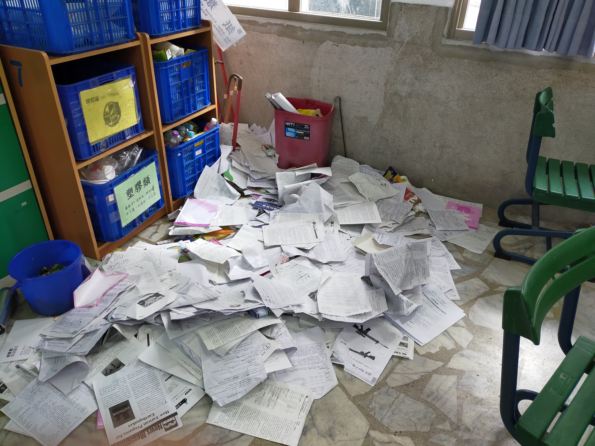

# 高中選修志化學3 2-6酸鹼滴定與滴定曲線 (請無視"志"字的存在)

Generate acid-base titration graphs

使用方法

 - 壹)選擇酸鹼等級

 - 貳)選擇酸鹼滴定順序

 - 參)輸入滴定物的平衡常數(Kc)

 - 肆)輸入滴定物的體積莫耳濃度(C大M)

 - 伍)輸入被滴定物的體積莫耳濃度(C大M)

然後步驟參在強對強時不需輸入也不會顯示

我就是故意讓使用者輸入介面是cmd，絕對不是我不會做GUI

順帶一提：物理比化學簡單，希望化學分數能到80分(成就達成)

考完會有兩種""，一個是玩樂的"玩"，另一個可想而知一定是完蛋的"完"。

## 執行結果長這樣

  
   

# 關於期末考的部分

考卷土石流，這很少見，通常是因為期末將至且考"完了"，書的存在並不是這麼的重要，因此開始瘋狂拋棄他們，而對積如山的考卷因磨擦力不足(微觀是電磁力)而墜落，其中數學課本被拿去"封印"一週沒倒的廚餘桶，不然整個班上會非常精彩。

  
   

